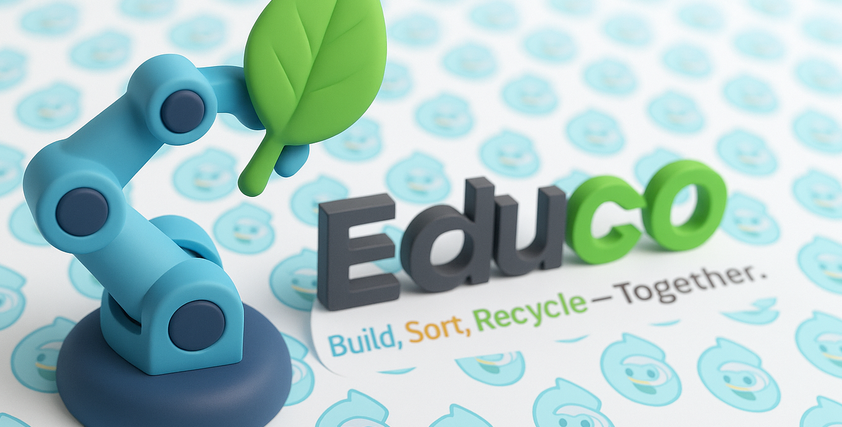
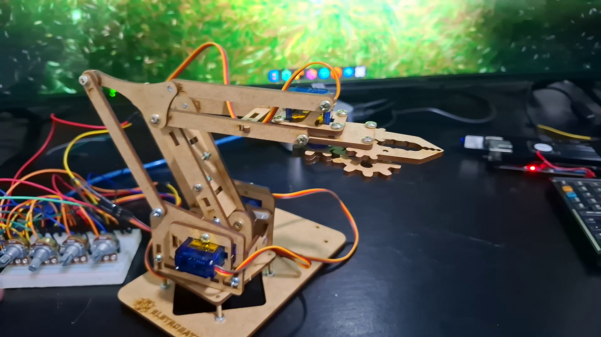

# EduCO
Low cost robot and AI integrations (pending). Play with Arduino, ESP32, Raspberry Pi or Orange Pi.

## 🎯 Objective
Build ultra-cheap educational robotics platform for schools/NGOs, controllable by SBCs (Single Board Computers) and Controllers. See the about video, [click here.](https://github.com/hugorteixeira/educo/raw/refs/heads/main/about_educo.mp4) 

## 📹 Current Demo
Basic movement via Arduino + potentiometer. See the [video demo.](https://github.com/hugorteixeira/educo/raw/refs/heads/main/demo_arduino.mp4)

## 🔧 Parts List ($35 total - AliExpress)
- Generic Arm: ~$16
- 4x SG90 Servos: ~$4
- Arduino/ESP32: ~$4
- 4x Potentiometers: ~$4
- Micro USB PSU/DIP Adapter: ~$3 
- Protoboard: <$2
- Jumpers: <$2

## 🚧 Development Status
- ✅ Basic Arduino movement
- 🔄 Orange Pi PWM optimization
- 🔄 Phosphobot integration
- 📋 Camera + AI vision (planned)
- 📋 Voice interaction (planned)
- 📋 Web remote control (planned)

## 💡 Credits (pending)

This project was started in Sao Paulo at the HuggingFace LeRobot Hackhaton 2025.

## 🤝 Want to Help?
- Test with different SBCs
- Improve servo control code
- Share educational use cases
