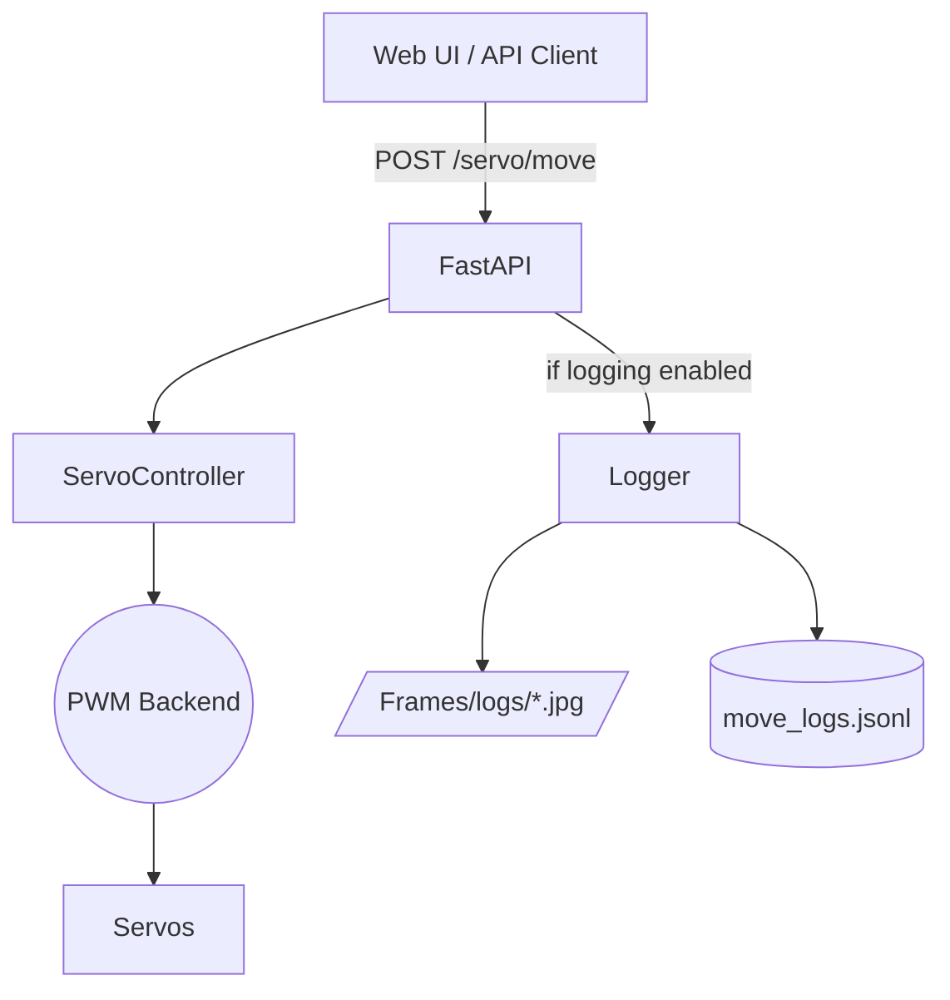

# EduCO 🤖

Low-cost robotics for schools and NGOs—now with a full Python control stack, live camera streaming, and dataset-ready move logging.


## 📚 Table of Contents
- [Mission](#mission)
- [Current Demo](#current-demo)
- [Quick Start](#quick-start)
- [Hardware Bill of Materials](#hardware-bill-of-materials)
- [Feature Tracker](#feature-tracker)
- [What Happens When You Move a Servo?](#what-happens-when-you-move-a-servo)
- [Live Roadmap](#live-roadmap)
- [Data Capture for ML Training](#data-capture-for-ml-training)
- [Credits](#credits)
- [How to Help](#how-to-help)

## 🎯 Mission
Build an ultra-cheap educational robotics platform controllable by SBCs (Orange Pi, Raspberry Pi, ESP32, Arduino…). The idea was born at the Hugging Face LeRobot Hackathon 2025 in São Paulo and is still expanding.

> 🎥 Want a quick overview? Watch the [about video](https://github.com/hugorteixeira/educo/raw/refs/heads/main/about_educo.mp4).

## 📹 Current Demo
Basic arm movement driven by an Arduino + potentiometer pair. See it in action in the [video demo](https://github.com/hugorteixeira/educo/raw/refs/heads/main/demo_arduino.mp4).


## ⚡ Quick Start
1. **Install dependencies**
   ```bash
   pip install -r robot_api/app/requirements.txt
   ```
2. **Launch the control stack**
   ```bash
   ./run_robot.sh            # Python UI at http://<host>:<port>/ui
   ./run_robot.sh --api-only # API only, no web UI
   ./run_robot.sh --ui none  # explicit UI disable
   ```
3. **Toggle “Log moves” in the UI** to capture pre/post snapshots + JSONL entries for ML datasets.

💡 Permissions: if you use software PWM (`servo_driver = soft`), add your user to the `gpio` group so libgpiod can access `/dev/gpiochip*`.

## 🧰 Hardware Bill of Materials (≈ $42 on AliExpress)
- Generic arm: ~$16
- ESP32 Cam MB: ~$8
- 4× SG90 servos: ~$4
- Arduino Nano: ~$4
- 4× potentiometers: ~$4
- Micro-USB PSU/DIP adapter: ~$3
- Protoboard: <$2
- Jumpers: <$2

## ✅ Feature Tracker
| Area | Status |
|------|--------|
| Basic Arduino movement | ✅ Complete |
| Orange Pi PWM optimisation | ✅ Complete |
| Custom Orange Pi demo | ✅ Complete |
| ESP32-CAM integration | ✅ Complete |
| REST control API (FastAPI) | ✅ Complete |
| Web UI (Python, neon theme, WASD controls) | ✅ Complete |
| Shiny R UI | 🗃️ Archived (see `deprecated/`) |
| Move logging with snapshots | ✅ Complete |
| AI vision loop | 🔄 Needs polish |
| VLA model fine-tuning | 🔜 Planned |
| Hugging Face Spaces deployment | 🔜 Planned |

## 🧠 What Happens When You Move a Servo?


## 🗺️ Live Roadmap
### Recently Landed
- ✨ Python-only launcher (`run_robot.sh`) with selectable UI mode.
- ✨ FastAPI UI with keyboard/touch control, neon styling, config form.
- ✨ Config edits for camera, per-part step size, and servo ranges directly from the browser.
- ✨ Move logging: pre/post camera snapshots + structured JSONL entries for ML training.

### Up Next
- 🔍 Integrate AI-assisted vision loop (autonomous reactions to camera frames).
- 🧠 Start fine-tuning a VLA model using the new move/image logs.
- ☁️ Publish a public demo (Hugging Face Space or lightweight cloud instance).
- 🛠️ Add calibration helpers (auto range detection, servo diagnostics).

### Longer Term Ideas
- 📦 Modular lesson plans + worksheets.
- 🪛 Swappable hardware profiles (Jetson Nano, Raspberry Pi 5, etc.).
- 🌐 Multi-user remote sessions with permissions.

## 🧾 Data Capture for ML Training
Toggle the “Log moves” switch in the UI to record each servo move:

- **Structured entry** (`logs/move_logs.jsonl`): pin, part, requested angle, servo status before/after, and links to snapshots.
- **Snapshots** (`frames/logs/<id>.jpg`): taken immediately before and after the move.
- Dataset-friendly: combine JSONL + images for behaviour cloning or VLA training.

```json
{
  "id": "8a5b8c...",
  "timestamp": "2025-03-18T02:44:19Z",
  "pin": 31,
  "part": "claw",
  "target_value": -20,
  "smooth": false,
  "status_before": [...],
  "status_after": [...],
  "camera": {
    "pre_image": "/frames/logs/pre_...jpg",
    "post_image": "/frames/logs/post_...jpg"
  }
}
```

## 🙌 Credits
Project kicked off at the Hugging Face LeRobot Hackathon 2025 in São Paulo. Huge thanks to everyone experimenting with ultra-low-cost robotics!

## 🤝 How to Help
- 🧪 Test on different SBCs (Jetson, Raspberry Pi, Banana Pi…)
- 🧷 Improve servo control and calibration routines
- 📸 Suggest better camera placements / streaming tips
- 🧑‍🏫 Share educational feedback or lesson ideas
- 🧠 Join the vision/model fine-tuning effort

> Have ideas or want to walk through the code together? Open an issue or drop a PR—let's make robotics accessible for every classroom.
