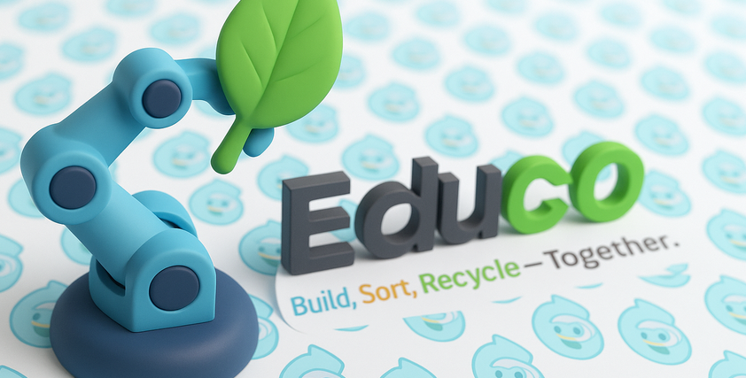

# EduCO
Low cost robot and AI integrations (pending). Play with Arduino, ESP32, Raspberry Pi or Orange Pi.

## 🎯 Objective
Build ultra-cheap educational robotics platform for schools/NGOs, controllable by SBCs (Single Board Computers) and Controllers. See the about video, [click here.](https://github.com/hugorteixeira/educo/raw/refs/heads/main/about_educo.mp4) 

## 📹 Current Demo
Basic movement via Arduino + potentiometer. See the [video demo.](https://github.com/hugorteixeira/educo/raw/refs/heads/main/demo_arduino.mp4)

## 🔧 Parts List ($45 total - AliExpress)
- Generic Arm: ~$16
- ESP32 Cam MB: ~$8
- 4x SG90 Servos: ~$4
- Arduino Nano: ~$4
- 4x Potentiometers: ~$4
- PCA9685: ~$3
- Micro USB PSU/DIP Adapter: ~$3 
- Protoboard: <$2
- Jumpers: <$2

Most parts are for testing purposes only.

## 🚧 Development Status
- ✅ Basic Arduino movement
- ✅ Orange Pi PWM optimization
- ✅ Orange Pi custom demo integration
- ✅ Camera integration (ESP32 Cam)
- ✅ REST API for robot control
- ✅ WASD-type controller (Shiny R, local)
- ✅ PCA9685 servo controller integration
- 🔄 WASD-type controller (Shiny Python, online)
- 🔄 AI Vision (it can see and move, but badly)
- 🔄 Fine tuning of a VLA model, probably MolmoAct-7B or GR00T
- 🔄 HuggingFace Spaces Setup

## 💡 Credits (pending)

This project was started in Sao Paulo at the HuggingFace LeRobot Hackhaton 2025.

## 🤝 Want to Help?
- Test with different SBCs
- Improve servo control code
- Share educational use cases
