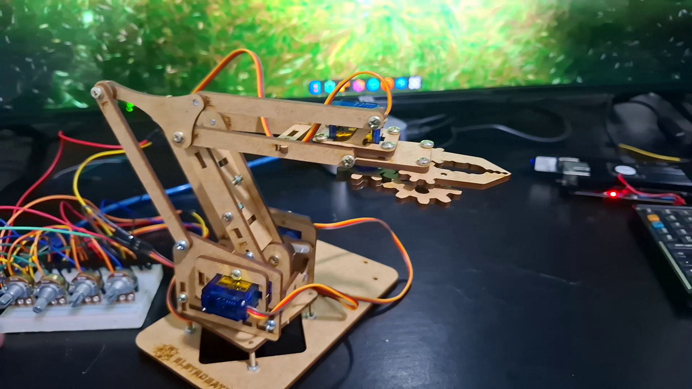
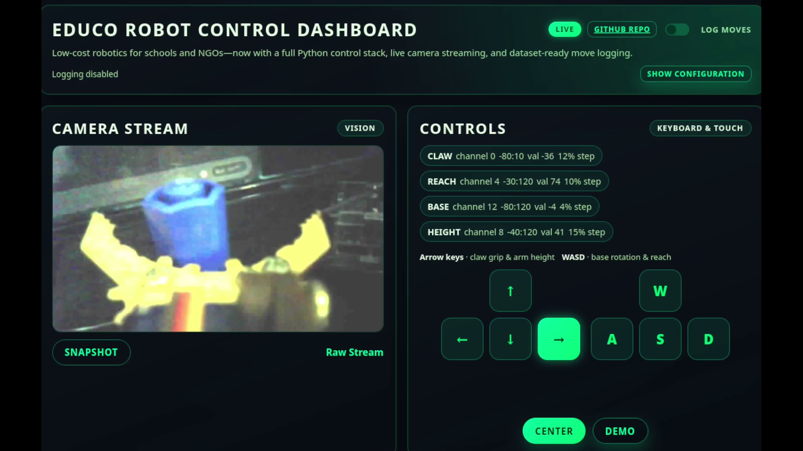
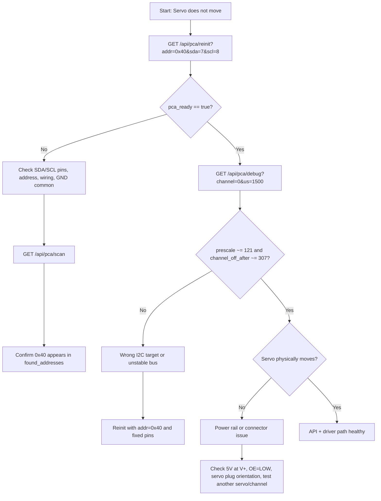
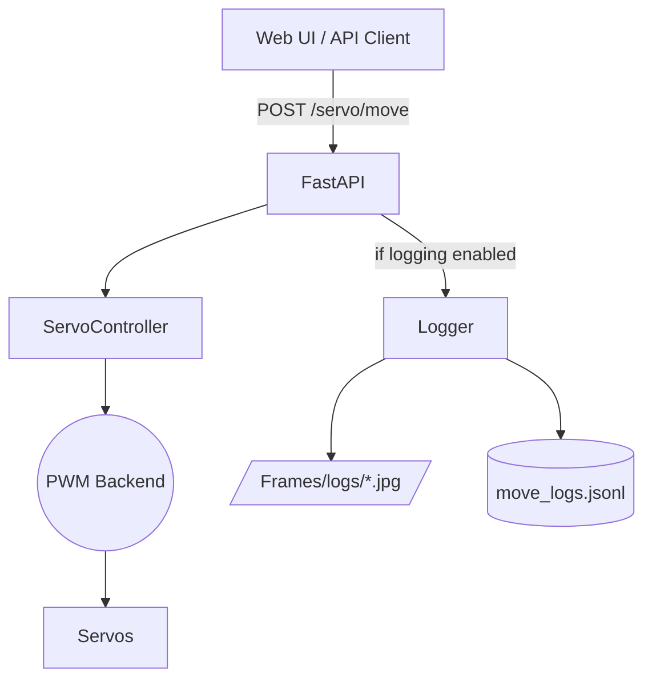

# EduCO 🤖

Low-cost robotics for schools and NGOs—now with a full Python control stack, live camera streaming, and dataset-ready move logging.



## 📚 Table of Contents
- [Mission](#mission)
- [Current Demo](#current-demo)
- [Quick Start](#quick-start)
- [ESP32-C3 + PCA9685 API](#esp32-c3--pca9685-api)
- [Terminal Joystick + Servo Calibration](#terminal-joystick--servo-calibration)
- [Troubleshooting Matrix](#troubleshooting-matrix)
- [Hardware Bill of Materials](#hardware-bill-of-materials)
- [Feature Tracker](#feature-tracker)
- [What Happens When You Move a Servo?](#what-happens-when-you-move-a-servo)
- [Live Roadmap](#live-roadmap)
- [Data Capture for ML Training](#data-capture-for-ml-training)
- [Credits](#credits)
- [How to Help](#how-to-help)

## 🎯 Mission
Build an ultra-cheap educational robotics platform controllable by SBCs (Orange Pi, Raspberry Pi, ESP32, Arduino…). The idea was born at the Hugging Face LeRobot Hackathon 2025 in São Paulo and is still expanding.

> 🎥 Want a quick overview? Watch the [about video](https://github.com/hugorteixeira/educo/raw/refs/heads/main/about_educo.mp4).

## 📹 Current Demo
Python app for controlling the robot with a WASD-based API interface and logging everywhere move with a picture for ML training (testing). See it in action in the [video demo](https://github.com/hugorteixeira/educo/raw/refs/heads/main/demo_robot_api.mp4).



## ⚡ Quick Start
1. **Install dependencies**
   ```bash
   pip install -r robot_api/app/requirements.txt
   ```
2. **Launch the control stack**
   ```bash
   ./run_robot.sh            # Python UI at http://<host>:<port>/ui
   ./run_robot.sh --api-only # API only, no web UI
   ./run_robot.sh --ui none  # explicit UI disable
   ```
3. **Toggle “Log moves” in the UI** to capture pre/post snapshots + JSONL entries for ML datasets.

💡 Permissions: if you use software PWM (`servo_driver = soft`), add your user to the `gpio` group so libgpiod can access `/dev/gpiochip*`.

## 🔌 ESP32-C3 + PCA9685 API
This repo also includes a standalone ESP32-C3 firmware focused only on PCA9685 servo control:

- Firmware path: `robot_api_esp32c3_pca9685/sketch/sketch.ino`
- Driver mode: HTTP API on ESP32 (no FastAPI dependency)
- Confirmed servo target: SG90 microservos at 50 Hz

### Endpoints
- `GET /health`
- `GET /api/pca/scan`
- `GET|POST /api/pca/reinit`
- `GET|POST /api/pca/move`
- `GET|POST /api/pca/test`
- `GET|POST /api/pca/debug`
- Compatibility aliases: `/servo/move`, `/servo/center`, `/servo/test-channels`, `/servo/status`, `/robot/status`

### Typical bring-up sequence
```bash
ESP=192.168.15.2

# lock bus pins + PCA address (example known-good setup)
curl "http://$ESP/api/pca/reinit?addr=0x40&sda=7&scl=8"

# check driver state + discovered addresses
curl "http://$ESP/health"
curl "http://$ESP/api/pca/scan"

# write one channel in microseconds
curl "http://$ESP/api/pca/move?channel=0&us=1500"
```

### Debugging tip
Use `GET /api/pca/debug?channel=<n>&us=<pulse>` to confirm register writes are sticking.
For a healthy PCA9685 @ 50 Hz, expect values like:
- `mode1: 161`
- `prescale: 121`
- `channel_off_after: ~307` for `us=1500`

If API replies `ok:true` but servos still do not move, validate hardware first:
- PCA9685 `OE` must be LOW (GND)
- servo rail `V+` must be externally powered (5V)
- common GND between ESP32, PCA9685, and servo PSU
- servo connector orientation and channel wiring

## 🎮 Terminal Joystick + Servo Calibration
Interactive SSH-friendly controller script:

- Script path: `testing_area/esp32_pca9685_joystick.sh`
- Purpose: manual joystick control, min/max sweep, and persistent per-servo calibration

### Run
```bash
./testing_area/esp32_pca9685_joystick.sh 192.168.15.2
```

### Optional overrides
```bash
PCA_ADDR=0x40 PCA_SDA=7 PCA_SCL=8 MIN_US=1000 MAX_US=2000 CHANNELS=0,4,12,8 \
./testing_area/esp32_pca9685_joystick.sh 192.168.15.2
```

### Key controls
- Select servo: `1..N`
- Move selected: arrows or `w/a/s/d`
- Go to selected limits: `z` (min), `x` (max)
- Sweep selected/all: `t` / `g`
- Center selected/all: `c` / `C`
- Reinit + health: `r` / `h`

### Live calibration controls
- Set selected servo limits from current position: `k` (set min), `l` (set max)
- Fine adjust selected limits: `n/m` (min -/+ 10us), `,/.` (max -/+ 10us)
- Global defaults adjust: `u/j` (global min -/+ 10us), `i/o` (global max -/+ 10us)
- Step tuning: `[` `]` (step -/+ 1us), `{` `}` (big step -/+ 5us)
- Reset selected/all servo limits to global defaults: `y` / `Y`
- Save/load calibration profile: `v` / `b`

Profile is persisted at:
- default: `~/.config/esp32_pca9685_joystick.profile`
- override: `PROFILE_PATH=/path/to/profile`

## 🩺 Troubleshooting Matrix

```mermaid
flowchart TD
    A[Start: Servo does not move] --> B[GET /api/pca/reinit?addr=0x40&sda=7&scl=8]
    B --> C{pca_ready == true?}
    C -- No --> D[Check SDA/SCL pins, address, wiring, GND common]
    D --> E[GET /api/pca/scan]
    E --> F[Confirm 0x40 appears in found_addresses]
    C -- Yes --> G[GET /api/pca/debug?channel=0&us=1500]
    G --> H{prescale ~= 121 and channel_off_after ~= 307?}
    H -- No --> I[Wrong I2C target or unstable bus]
    I --> J[Reinit with addr=0x40 and fixed pins]
    H -- Yes --> K{Servo physically moves?}
    K -- No --> L[Power rail or connector issue]
    L --> M[Check 5V at V+, OE=LOW, servo plug orientation, test another servo/channel]
    K -- Yes --> N[API + driver path healthy]
```

| Symptom | Likely Cause | Verify | Fix |
|------|--------|--------|--------|
| `{"ok":false,"error":"pca_write_failed"}` | PCA not initialized or wrong bus pins | `curl "http://$ESP/health"` | Run `reinit` with explicit params: `addr=0x40&sda=7&scl=8` |
| `pca_ready:false` and `i2c_sda_pin:-1` | No working I2C pin pair detected | `curl "http://$ESP/api/pca/scan"` | Re-check wiring and force valid pins in `/api/pca/reinit` |
| `found_addresses` has multiple devices and motion still fails | Wrong I2C address selected | `curl "http://$ESP/api/pca/debug?channel=0&us=1500"` | Force `addr=0x40`; do not use unrelated addresses |
| `mode1=161`, `prescale=121`, `channel_off_after~307`, but no movement | PWM is correct; hardware path to servo is wrong | `curl "http://$ESP/api/pca/move?channel=0&us=1000"` then `2000` | Check servo power (`V+` 5V), common GND, connector orientation, channel wiring |
| Moves once, then seems dead | Re-sending same pulse (no visible change) | Repeat with alternating pulses | Use sequence like `1000 -> 2000 -> 1000 -> 1500` |
| Jitter or weak movement | Insufficient current from power supply | Observe servo under load while sending sweep | Use dedicated 5V PSU with enough current; keep common GND |
| Only one channel works | Wrong channel mapping | Sweep all channels via `api/pca/test` or joystick `g` | Update channel map (`CHANNELS=` in joystick script or firmware mapping) |
| API says `ok:true` but no servo signal | `OE` pin high (outputs disabled) | Electrical check of OE pin | Tie `OE` to GND (LOW) |

## 🧰 Hardware Bill of Materials (≈ $42 on AliExpress)
- Generic arm: ~$16
- ESP32 Cam MB: ~$8
- 4× SG90 servos: ~$4
- Arduino Nano: ~$4
- 4× potentiometers: ~$4
- Micro-USB PSU/DIP adapter: ~$3
- Protoboard: <$2
- Jumpers: <$2

## ✅ Feature Tracker
| Area | Status |
|------|--------|
| Basic Arduino movement | ✅ Complete |
| Orange Pi PWM optimisation | ✅ Complete |
| Custom Orange Pi demo | ✅ Complete |
| ESP32-CAM integration | ✅ Complete |
| REST control API (FastAPI) | ✅ Complete |
| Web UI (Python, neon theme, WASD controls) | ✅ Complete |
| Shiny R UI | 🗃️ Archived (see `deprecated/`) |
| Move logging with snapshots | ✅ Complete |
| AI vision loop | 🔄 Needs polish |
| VLA model fine-tuning | 🔜 Planned |
| Hugging Face Spaces deployment | 🔜 Planned |

## 🧠 What Happens When You Move a Servo?

```mermaid
graph TD
    UI[Web UI / API Client] -->|POST /servo/move| FastAPI
    FastAPI --> Controller[ServoController]
    Controller --> Backend((PWM Backend))
    Backend --> Servos
    FastAPI -->|if logging enabled| Logger
    Logger --> Frames[/Frames/logs/*.jpg/]
    Logger --> Dataset[(move_logs.jsonl)]
```

## 🗺️ Live Roadmap
### Recently Landed
- ✨ Python-only launcher (`run_robot.sh`) with selectable UI mode.
- ✨ FastAPI UI with keyboard/touch control, neon styling, config form.
- ✨ Config edits for camera, per-part step size, and servo ranges directly from the browser.
- ✨ Move logging: pre/post camera snapshots + structured JSONL entries for ML training.

### Up Next
- 🔍 Mobile First - Always.

Building, connecting, running code for the robot is not hard, but it requires a bunch of equipment and time to do it properly. Since time and a bunch of computers and connectors and whatnot are not exactly cheap for unprivileged kids and their parents, it was decided that this project has to be mobile first.

The robot has to run on a cheap Android smartphone with Termux or a Python web interface made with FastAPI, otherwise, it could be more frustrating than educative for the kids. Also, computers are losing popularity to smartphones since the 2010s and the less that is required, the better it is.

## 🧾 Data Capture for ML Training
Toggle the “Log moves” switch in the UI to record each servo move:

- **Structured entry** (`logs/move_logs.jsonl`): pin, part, requested angle, servo status before/after, and links to snapshots.
- **Snapshots** (`frames/logs/<id>.jpg`): taken immediately before and after the move.
- Dataset-friendly: combine JSONL + images for behaviour cloning or VLA training.

```json
{
  "id": "8a5b8c...",
  "timestamp": "2025-03-18T02:44:19Z",
  "pin": 31,
  "part": "claw",
  "target_value": -20,
  "smooth": false,
  "status_before": [...],
  "status_after": [...],
  "camera": {
    "pre_image": "/frames/logs/pre_...jpg",
    "post_image": "/frames/logs/post_...jpg"
  }
}
```

## 🙌 Credits
Project kicked off at the Hugging Face LeRobot Hackathon 2025 in São Paulo. Huge thanks to everyone experimenting with ultra-low-cost robotics!

## 🤝 How to Help
- 🧪 Test on different SBCs (Jetson, Raspberry Pi, Banana Pi…)
- 🧷 Improve servo control and calibration routines
- 📸 Suggest better camera placements / streaming tips
- 🧑‍🏫 Share educational feedback or lesson ideas
- 🧠 Join the vision/model fine-tuning effort

> Have ideas or want to walk through the code together? Open an issue or drop a PR—let's make robotics accessible for every classroom.
